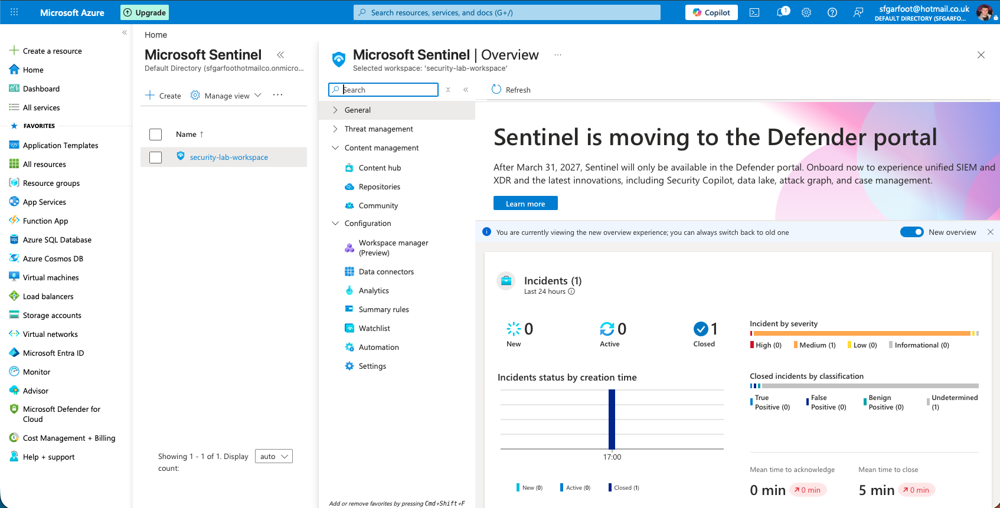
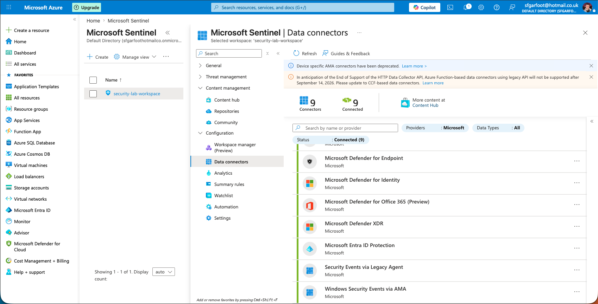
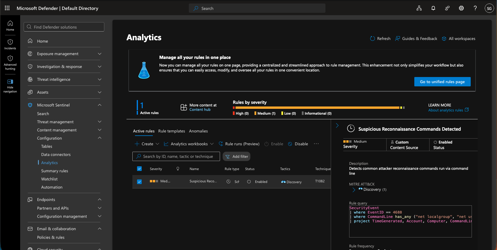
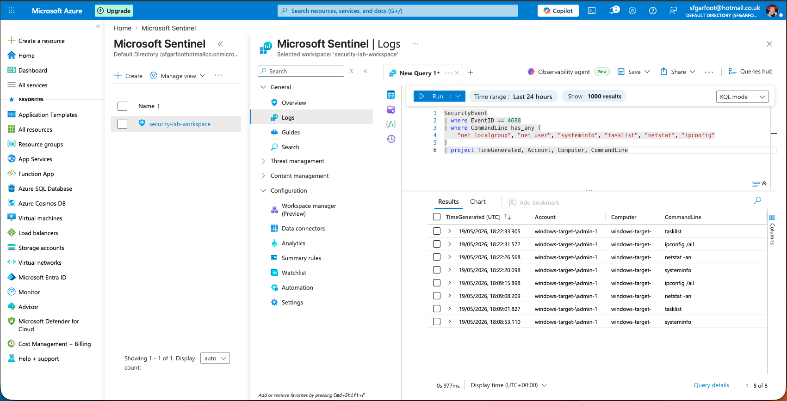
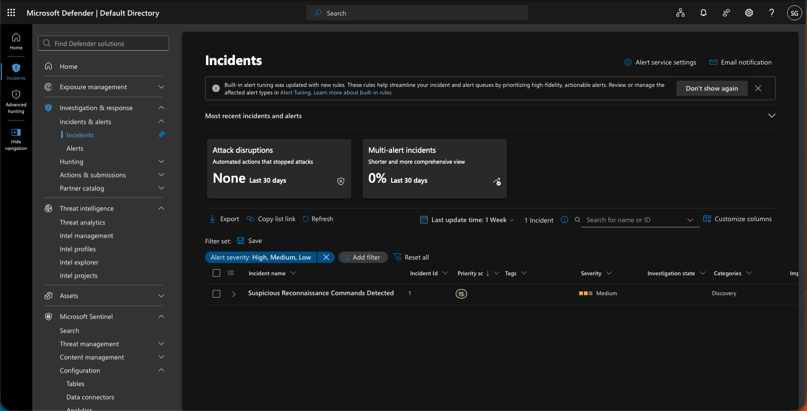
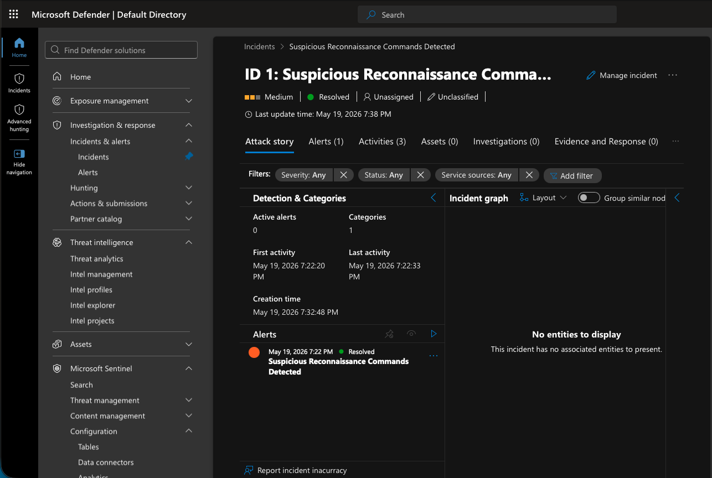
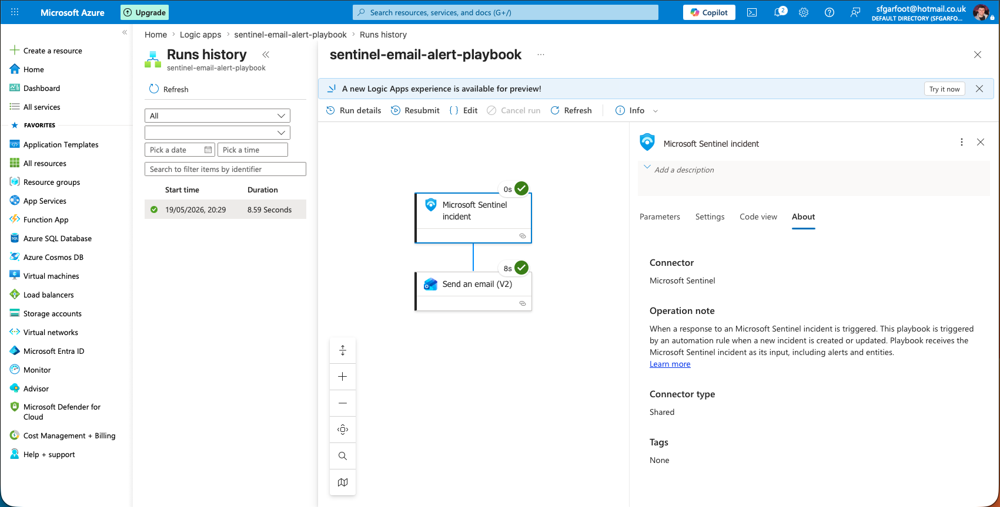
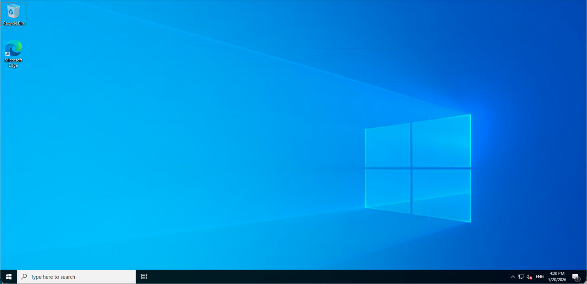
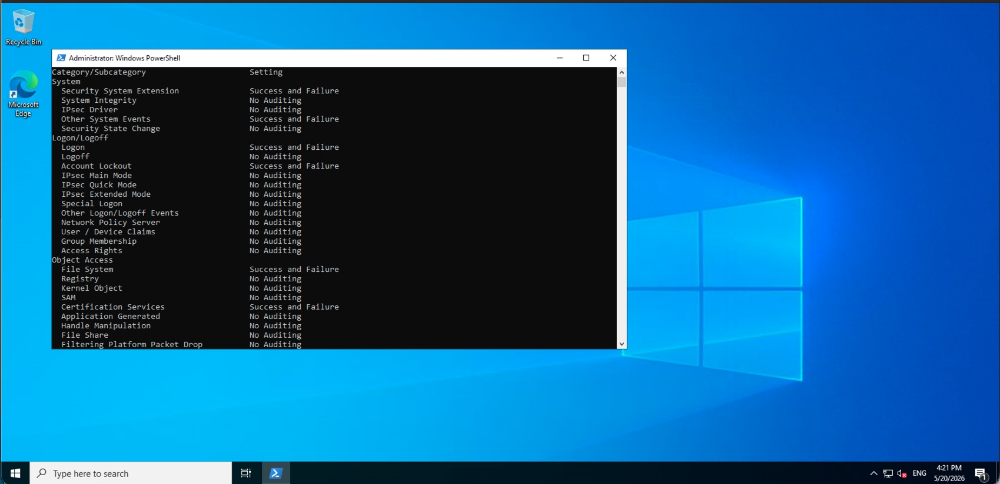

# Azure SOC Lab

A hands-on security operations lab built on Microsoft Azure, demonstrating end-to-end threat detection, log analysis, and automated incident response using Microsoft Sentinel, Defender XDR, and Defender for Cloud. Built to develop practical experience across SIEM/SOC operations, detection engineering, and cloud security hardening — directly aligned to real-world government and enterprise security environments.

---

## Lab Architecture

```
Windows Server 2022 VM (North Europe)
        │
        │ Windows Security Events via AMA
        ▼
Log Analytics Workspace
        │
        ▼
Microsoft Sentinel ──────────────────── Defender XDR Portal
        │                                       │
        ├── Analytics Rules (KQL)               ├── Incidents & Alerts
        ├── Incident Management                 ├── Threat Hunting
        └── Automation (Logic Apps/SOAR)        └── Unified Investigation
```

---

## Components

| Component | Purpose |
|---|---|
| Azure Virtual Machine (Windows Server 2022) | Target endpoint generating security telemetry |
| Microsoft Sentinel | SIEM — log ingestion, detection, incident management |
| Log Analytics Workspace | Centralised log storage and KQL query engine |
| Microsoft Defender XDR | Unified security operations portal |
| Microsoft Defender for Cloud | Cloud security posture management and hardening |
| Azure Logic Apps | SOAR — automated incident response playbook |
| Data Collection Rule (AMA) | Windows Security Event ingestion pipeline |

---

## What Was Configured

### 1. Windows Audit Policy Hardening
Default Windows Server audit policy was assessed and found to be critically under-configured — only Process Creation was logging. The following categories were enabled via PowerShell using `auditpol`, directly implementing **CIS Control 8 (Audit Log Management)** and the **NIST CSF Detect function**:

```powershell
auditpol /set /category:"Logon/Logoff" /success:enable /failure:enable
auditpol /set /category:"Account Management" /success:enable /failure:enable
auditpol /set /category:"Privilege Use" /success:enable /failure:enable
auditpol /set /category:"Policy Change" /success:enable /failure:enable
auditpol /set /category:"System" /success:enable /failure:enable
```

### 2. Command Line Logging
Enabled full command line capture in process creation events via Group Policy and registry configuration:

```
HKLM\SOFTWARE\Microsoft\Windows\CurrentVersion\Policies\System\Audit
ProcessCreationIncludeCmdLine_Enabled = 1
```

This enables Event ID 4688 to capture full command line arguments — critical for post-exploitation detection and forensic investigation.

### 3. Sentinel Data Pipeline
- Deployed **Windows Security Events via AMA** connector
- Configured **Data Collection Rule** to forward Common security events from the VM to the Log Analytics workspace
- Validated ingestion by querying `SecurityEvent` table in real time

---

## Detection Engineering

### Custom Analytics Rule — Suspicious Reconnaissance Commands

Built a scheduled KQL analytics rule to detect attacker reconnaissance behaviour mapped to **MITRE ATT&CK T1082 — System Information Discovery**:

```kql
SecurityEvent
| where EventID == 4688
| where CommandLine has_any (
    "net localgroup",
    "net user",
    "systeminfo",
    "tasklist",
    "netstat",
    "ipconfig"
)
| project TimeGenerated, Account, Computer, CommandLine
```

**Rule configuration:**
- Trigger: Scheduled, every 5 minutes
- MITRE ATT&CK mapping: TA0007 Discovery / T1082 System Information Discovery
- Severity: Medium
- Incident creation: Enabled

---

## KQL Queries

### Failed Logon Attempts (Brute Force Detection)
```kql
SecurityEvent
| where EventID == 4625
| project TimeGenerated, Account, Computer, IpAddress
```

### RDP Logon Events (Remote Access Monitoring)
```kql
SecurityEvent
| where EventID == 4624
| where LogonType == 10
| project TimeGenerated, Account, Computer, IpAddress, LogonType
```

### All Logon Activity
```kql
SecurityEvent
| where EventID in (4624, 4625, 4634, 4647)
| project TimeGenerated, EventID, Account, Computer, LogonType
| order by TimeGenerated desc
```

### Command Line Activity (Post-Exploitation Detection)
```kql
SecurityEvent
| where EventID == 4688
| project TimeGenerated, Account, Computer, CommandLine
```

### Recent Security Events
```kql
SecurityEvent
| where TimeGenerated > ago(1h)
| project TimeGenerated, EventID, Account, Computer
| order by TimeGenerated desc
```

---

## Incident Response Workflow

Simulated a full SOC analyst incident response lifecycle:

1. **Detection** — Analytics rule fired on reconnaissance commands
2. **Triage** — Incident reviewed in Defender XDR portal, evidence and entities examined
3. **Assignment** — Incident assigned to analyst
4. **Investigation** — Attack story, alerts, and command line evidence reviewed
5. **Resolution** — Incident closed as True Positive with documented findings
6. **Retention** — Incident record retained for audit trail (never deleted — compliance requirement)

---

## SOAR — Automated Response Playbook

Built an Azure Logic App triggered by Sentinel incidents to automate email alerting:

- **Trigger:** Microsoft Sentinel — When incident is created
- **Action:** Send email via Outlook with dynamic incident fields:
  - Incident title
  - Severity
  - Status
  - Description
- **Outcome:** Automated notification pipeline validated end-to-end — mirrors enterprise SOAR alerting workflows

---

## Screenshots

### 01 — Sentinel Overview

Microsoft Sentinel workspace dashboard showing the active security operations environment with connected data sources and workspace configuration.

### 02 — Data Connectors

Data connectors page showing Windows Security Events via AMA and Microsoft Entra ID Protection successfully connected and ingesting logs into the Log Analytics workspace.

### 03 — Analytics Rules

Custom scheduled analytics rule "Suspicious Reconnaissance Commands Detected" mapped to MITRE ATT&CK T1082 System Information Discovery, running every 5 minutes against live endpoint telemetry.

### 04 — Sentinel Logs & KQL Query

KQL query executed against the SecurityEvent table detecting attacker reconnaissance commands including systeminfo, netstat, ipconfig and net localgroup, with full CommandLine visibility enabled via audit policy configuration.

### 05 — Incidents Page

Microsoft Sentinel incidents queue showing the triggered incident generated by the custom analytics rule following simulated post-exploitation reconnaissance activity.

### 06 — Incident Detail

Incident investigation view showing full evidence trail including detected commands, affected entities, timeline, and analyst workflow — assigned, investigated, and resolved as True Positive.

### 07 — SOAR Playbook

Azure Logic App automated response playbook triggered by Sentinel incidents, configured to send automated email alerts with dynamic incident fields including title, severity, status and description — mirroring enterprise SOAR alerting workflows.

### 08 — Windows Server VM

Windows Server 2022 Datacenter target endpoint deployed in Azure, used to generate security telemetry via simulated attacker reconnaissance and post-exploitation activity.

### 09 — Audit Policy Configuration

Windows audit policy output following hardening — all critical categories including Logon/Logoff, Account Management, Privilege Use, Policy Change and System configured to log Success and Failure events, implementing CIS Control 8 and NIST CSF Detect function.

---

## Attack Simulation

Simulated attacker post-exploitation reconnaissance to generate real security telemetry:

**CMD-based reconnaissance (Discovery phase):**
```
net localgroup administrators
net user /domain
systeminfo
tasklist
netstat -an
ipconfig /all
```

**PowerShell-based investigation commands:**
```powershell
Get-LocalUser
Get-LocalGroup
Get-LocalGroupMember Administrators
Get-Process
Get-Service
Get-NetTCPConnection
Get-ScheduledTask | Where-Object {$_.TaskPath -notlike "\Microsoft*"}
Get-CimInstance Win32_StartupCommand
Get-NetFirewallRule | Where-Object {$_.Enabled -eq "True"}
Get-NetTCPConnection | Where-Object {$_.State -eq "Listen"}
```

All activity was generated within a self-contained Azure lab subscription against owned infrastructure.

---

## Security Frameworks Referenced

| Framework | Application |
|---|---|
| MITRE ATT&CK | Detection rule mapped to T1082 System Information Discovery |
| NIST CSF | Detect function implemented via audit logging and SIEM ingestion |
| CIS Control 8 | Audit Log Management — policy hardening and log centralisation |

---

## Key Windows Security Event IDs

| Event ID | Description |
|---|---|
| 4624 | Successful logon |
| 4625 | Failed logon |
| 4634 | Logoff |
| 4647 | User initiated logoff |
| 4648 | Logon using explicit credentials |
| 4672 | Special privileges assigned (admin logon) |
| 4688 | New process created |
| 4720 | User account created |
| 4732 | User added to local group |
| 1102 | Audit log cleared |

---

## In Progress

- [ ] Entra ID (Azure AD) sign-in log integration
- [ ] NSG Flow Log analysis
- [ ] Brute force detection rule with threshold-based alerting
- [ ] Microsoft Defender for Endpoint onboarding
- [ ] Defender for Cloud secure score remediation
- [ ] Advanced KQL — threat hunting queries

---

## Environment

- **Cloud:** Microsoft Azure (Trial)
- **Region:** North Europe
- **VM:** Windows Server 2022 Datacenter Azure Edition Gen 2
- **SIEM:** Microsoft Sentinel
- **Portal:** Microsoft Defender XDR (security.microsoft.com)
